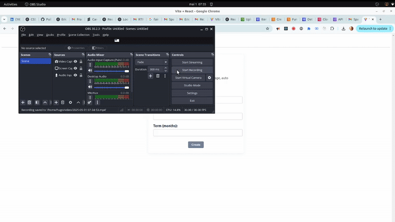
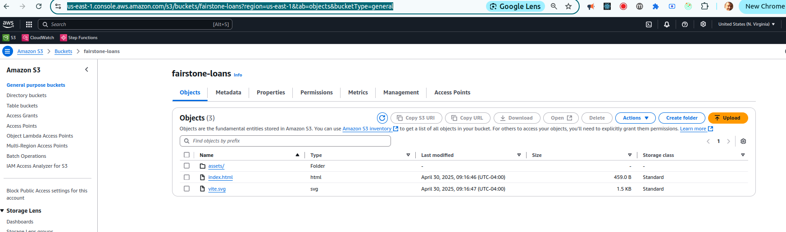
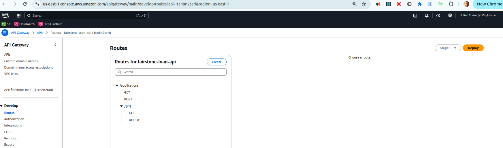
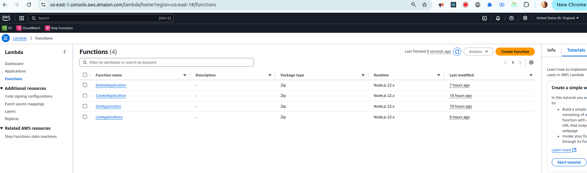
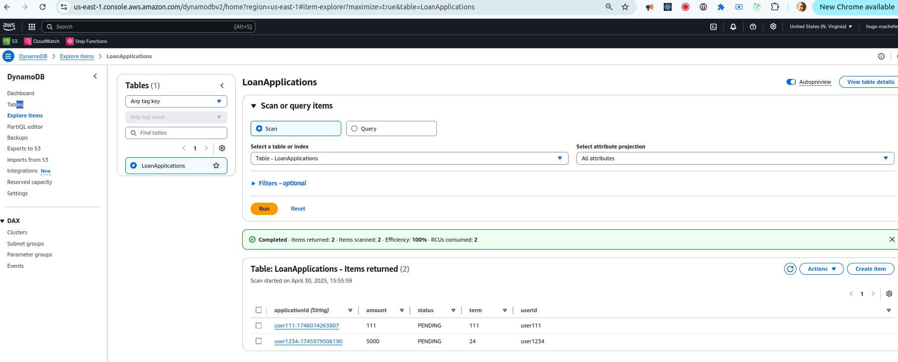
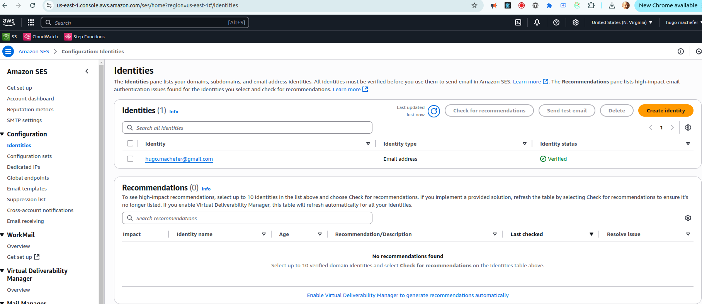
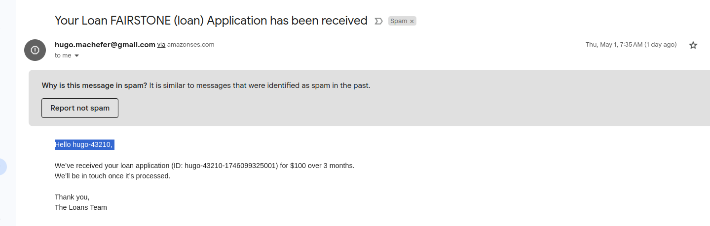

# FairStone Loans Application



## 📝 Overview

FairStone Loans is a serverless web application that allows users to create, list, retrieve, and delete loan applications. The project is built with:

- **Frontend**: React (Vite)
- **API**: AWS API Gateway (HTTP API)
- **Compute**: AWS Lambda
- **Data**: AWS DynamoDB
- **Hosting**: AWS S3 (static website hosting)

This architecture provides a fully managed, scalable solution without the need for a traditional backend server.

---

## 🚀 Architecture

```plaintext
┌─────────────┐        ┌─────────────────┐        ┌──────────────────┐
│   Browser   │ <----> │ API Gateway (🌐) │ <----> │ AWS Lambda (🖥️) │
└─────────────┘        └─────────────────┘        └──────────────────┘
                                   │                     │
                                   │                     ▼
                                   │              DynamoDB Table
                                   │              `LoanApplications`
                                   ▼
                        S3 Bucket: `fairstone-loans`
                       (host index.html + assets)
```

- **S3 Bucket**: Hosts the compiled React app (`index.html`, `vite.svg`, and `assets/`).
- **API Gateway**: Defines HTTP routes and integrates with Lambda:
  - `GET    /applications`       → `ListApplications` Lambda
  - `POST   /applications`       → `CreateApplication` Lambda
  - `GET    /applications/{id}`  → `GetApplication` Lambda
  - `DELETE /applications/{id}`  → `DeleteApplication` Lambda
- **AWS Lambda Functions**: Handle business logic and interact with DynamoDB.
- **DynamoDB Table**: `LoanApplications` with primary key `applicationId` (String). Stores loan details (`amount`, `term`, `status`, `userId`, etc.).

---

## 🎬 Demo


---

## 🖥️ Screenshots

Below are key AWS Console views illustrating the deployed infrastructure. Click each image to view full size:

### S3 Bucket Objects
[](./project/assets/s3.png)

### API Gateway Routes
[](./project/assets/api_gateway.png)

### Lambda Functions
[](./project/assets/lambdas.png)

### DynamoDB Table Items
[](./project/assets/dynamodb.png)

### SES email
[](./project/assets/ses.png)

### Email message notification
[](./project/assets/email.png)

---

## 🛠️ Getting Started

### Prerequisites

- [Node.js](https://nodejs.org/) >= v14
- [npm](https://www.npmjs.com/) or [Yarn](https://yarnpkg.com/)
- AWS account with permissions for S3, API Gateway, Lambda, and DynamoDB
- [AWS CLI](https://docs.aws.amazon.com/cli/latest/userguide/install-cliv2.html) configured (`aws configure`)

### 1. Clone the Repository

```bash
git clone https://github.com/your-org/fairstone-aws-react-loans.git
cd fairstone-aws-react-loans
```

### 2. Frontend Setup & Development

```bash
# Install dependencies
npm install

# Start dev server (Vite)
npm run dev
```
Open your browser at `http://localhost:5173` to view the app.

### 3. Build & Deploy Frontend to S3

```bash
# Build static assets
npm run build

# Sync to S3 (replace with your bucket name)
aws s3 sync dist/ s3://fairstone-loans --acl public-read
```

### 4. Backend Deployment

#### a. Deploy Backend with Terraform

All backend infrastructure—including the DynamoDB table, Lambda functions, and API Gateway routes—is defined in Terraform (`main.tf` and `variables.tf`). After configuring your AWS credentials and any necessary variables (e.g., in `terraform.tfvars`), initialize and apply Terraform:

```bash
terraform init
terraform apply
```

This process will automatically package and deploy your Lambda functions from `lambdas/`, create the DynamoDB `LoanApplications` table, and wire up the HTTP API with its routes.

---

## 📁 Project Structure

```plaintext
project/
├─ README.md
├─ package.json
├─ public/
│  ├─ vite.svg
│  └─ index.html
├─ src/
│  ├─ assets/           # Static images & GIFs
│  ├─ components/       # React components
│  ├─ App.jsx
│  └─ main.jsx
├─ dist/                # Compiled frontend (output of `npm run build`)
├─ lambdas/             # Lambda function source directories
│  ├─ createLoanApplication/
│  └─ getLoanApplications/
├─ lambda_zips/         # Zipped Lambda function packages (auto-generated by Terraform)
│  ├─ createLoanApplication.zip
│  └─ getLoanApplications.zip
└─ scripts/             # Deployment scripts (optional)
```

---

## 🤝 Contributing

1. Fork the repo
2. Create a new branch (`git checkout -b feature/XYZ`)
3. Commit your changes (`git commit -m "Add XYZ feature"`)
4. Push to your branch (`git push origin feature/XYZ`)
5. Open a Pull Request

Please follow the [Code of Conduct](CODE_OF_CONDUCT.md) and ensure all tests pass.

---

## 📄 License

This project is licensed under the MIT License. See [LICENSE](LICENSE) for details.
